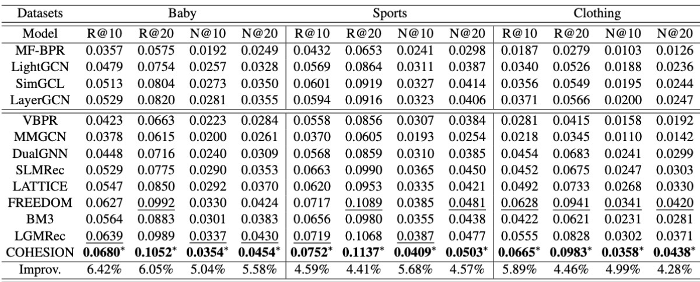

# COHESION: Composite Graph Convolutional Network with Dual-Stage Fusion for Multimodal Recommendation

<!-- PROJECT LOGO -->

## Introduction

This is the Pytorch implementation for our CROWNER paper:

>COHESION: Composite Graph Convolutional Network with Dual-Stage Fusion for Multimodal Recommendation

## Environment Requirement
- python 3.9
- Pytorch 2.1.0

## Dataset

All experiments conducted on three processed datasets: Baby, Sports, Clothing

## Training
  ```
  cd ./src
  python main.py
  ```
## Performance Comparison


## Citing COHESION

If you find COHESION useful in your research, please consider citing our [paper](https://arxiv.org/pdf/2504.04452).

```
@article{xu2025cohesion,
  title={COHESION: Composite Graph Convolutional Network with Dual-Stage Fusion for Multimodal Recommendation},
  author={Xu, Jinfeng and Chen, Zheyu and Wang, Wei and Hu, Xiping and Kim, Sang-Wook and Ngai, Edith CH},
  journal={arXiv preprint arXiv:2504.04452},
  year={2025}
}
```


## Acknowledgement

The structure of this code is  based on [MMRec](https://github.com/enoche/MMRec). Thank for their work.
